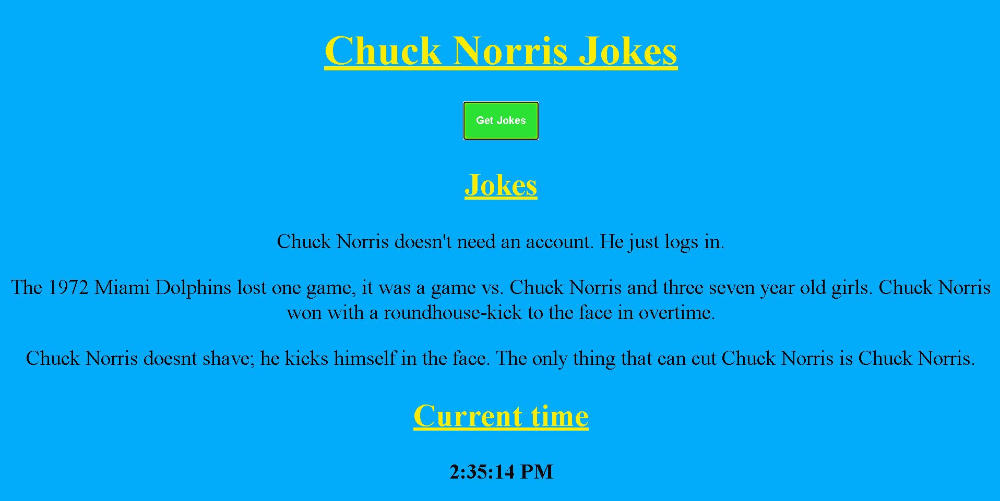

# fetch-api-javascript

This project focusses on working with async functions &amp; fetch methods to retrieve data from an API.

## Fetch API:

* The web page displays three random Chuck Norris jokes with the use of a fetch method and an API to retrieve the jokes.
* The web page also displays the current time and it is updated every second.

## Display of page:

## Use of code:

Open the file with the .html extention in the browser of your choice to view the web page.

To view or edit the code, I'd suggest opening the project folder in a text editor like Sublime Text or Visual Studio Code.

I hope that my code can potentially help you with your future projects.

Happy Coding :sunglasses:
